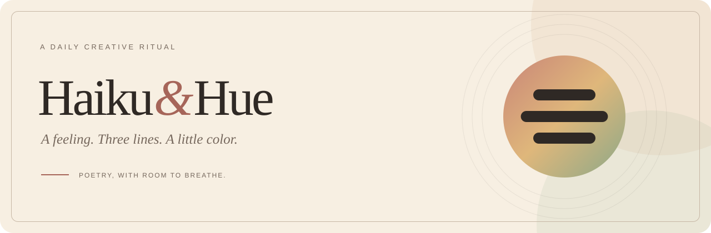

# Haiku&Hue



<p align="center">
  <strong>A daily creative ritual, in poetry and color.</strong><br>
  Turn a feeling into three lines. Find its colors. Make it yours.
</p>

<p align="center">
  <a href="#the-daily-ritual">The experience</a> &middot;
  <a href="#try-it-locally">Local setup</a> &middot;
  <a href="#where-things-stand">Project status</a> &middot;
  <a href="docs/brand/README.md">Logo explorations</a>
</p>

---

## A little space for how today feels

Some days begin with a bright idea. Others begin with rain at the window and a cup of tea gone cold. **Haiku&Hue** is a personal creative studio for turning those small moments into haikus and complementary artwork.

The idea is simple: prepare the possibilities, keep the creative decisions yours, and share only what you approve.

> A gray morning waits<br>
> Rain taps softly on the glass<br>
> I let the world slow
>
> *An example poem for a reflective morning. Imagine slate-blue watercolor, a pale patch of light, and room to breathe.*

## The daily ritual

| Check in | Find a pairing | Make it yours | Review and share |
|---|---|---|---|
| Bring your feelings, inspiration, and a visual direction. | Explore poems and procedural backgrounds in different combinations. | Refine the words, caption, accessibility text, and typography. | Review the composition, approve it, and download artwork for manual sharing. |

Your workspace has four places to return to:

**Today** is the studio table. **Review** is the final look before sharing. **The Haiku Almanac** is your private archive. **Settings** holds your daily preferences and destination information.

## Where things stand

**Early MVP.** The creative studio and manual image export are implemented. Live AI generation and social publishing are not connected; this is not yet a production-ready publishing service.

| Available in the current MVP | Still ahead |
|---|---|
| Single-owner password gate and paper-and-ink interface | Production hardening and fuller privacy controls |
| Mood check-in with multiple feelings, intensity, visual style, and emotional direction | Independently adjustable haiku and artwork sample counts |
| Three sample poems, three procedural backgrounds, and nine possible pairings | Live text-model integration and optional AI artwork |
| Poem, caption, alt-text, and typography editing | Creative-bias controls, selective regeneration, locks, and undo/redo |
| Draft revisions and approval snapshots; covered edits return the post to draft | Complete dispatch-time approval enforcement and safe provider reconciliation |
| Square and portrait PNG downloads rendered with Sharp | Authorized social connectors and vertical video |
| PostgreSQL persistence, queue records, and a separate worker | End-to-end automated reminders and daily preparation |

The text-generation implementation currently returns sample poems. **Adding an API key alone does not enable live generation.** Keep `TEXT_MODEL_PROVIDER="demo"` until a real provider is implemented.

### Sharing, without pretending

Manual sharing is the usable route today: download your artwork and copy the reviewed caption and alt text into your chosen app.

Instagram, Facebook Pages, Threads, X, Bluesky, Mastodon, LinkedIn, Pinterest, and YouTube Shorts are planned integrations, not connected destinations. TikTok Direct Post is marked blocked for this private utility; an eligible integration or manual handoff is needed. The project does not automate browser logins.

Queue and delivery states are an early implementation, **not proof that a social post went live**. No live publishing adapter is present.

## Try it locally

Use a current Node.js LTS release compatible with Next.js 16, npm, and a running PostgreSQL database. The app and worker run as separate processes.

1. Install dependencies.

   ```sh
   npm install
   ```

2. Copy `.env.example` to `.env`. In PowerShell:

   ```powershell
   Copy-Item .env.example .env
   ```

   On macOS or Linux, use `cp .env.example .env`.

3. Set `DATABASE_URL` to your local PostgreSQL database, replace the placeholder `APP_SECRET`, and leave text generation in demo mode. Keep `.env` private.

4. Apply the database schema and load example data.

   ```sh
   npm run db:migrate
   npm run db:seed
   ```

5. Start the web app.

   ```sh
   npm run dev
   ```

   In a second terminal, start the worker.

   ```sh
   npm run worker
   ```

6. Open [localhost:3000](http://localhost:3000). The example configuration uses the development password `demo` when no password hash is set. **Do not use the demo password or placeholder secret in a deployed instance.**

Persistent editing requires a working database. The fallback sample view is not a substitute for database setup.

### Everyday commands

| Command | Purpose |
|---|---|
| `npm run dev` | Start the development web app |
| `npm run worker` | Process background jobs |
| `npm run worker -- --once` | Process at most one due job |
| `npm run db:migrate` | Apply development database migrations |
| `npm run db:seed` | Load example data |
| `npm test` | Run the existing unit tests |
| `npm run lint` | Run ESLint |
| `npm run build` | Generate the Prisma client and build the Next.js app |

## Under the paper

**Next.js + TypeScript + Tailwind CSS** for the studio, **PostgreSQL + Prisma** for persistence, and **SVG + Sharp** for rendered artwork. A separate Node.js worker handles database-backed queue jobs.

The poem is typeset separately from the background, keeping spelling, line breaks, and layout under application control rather than asking an image model to draw text. Syllable counts are estimates with uncertainty, not a guarantee of perfect 5-7-5.

### A note on privacy and approval

The intended boundary is explicit approval of the final composition before publishing. Keep journal input private, review all public text, and do not treat the early MVP as a hardened secret journal.

**The current sample caption generator includes inspiration text in its suggested captions.** Remove anything private before exporting or sharing. Publishing credentials are not connected; generation credentials must remain separate from any future publishing credential store.

Production mode requires `APP_SECRET` and `APP_PASSWORD_HASH`. Review the implementation and deployment configuration before exposing an instance publicly.

## A visual identity, taking shape

The working direction is **Three lines**: three ink strokes in a 5:7:5 width ratio over a wash of color. Poetry gives the mark its structure; the hue gives it its mood.

Two alternatives explore an open book at daybreak and three overlapping petals. These are original, editable SVG concepts, not a finalized brand selection.

[Explore all three logos, the monochrome mark, and the palette](docs/brand/README.md).

---

<p align="center"><em>A feeling. Three lines. A little color.</em></p>
