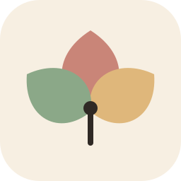
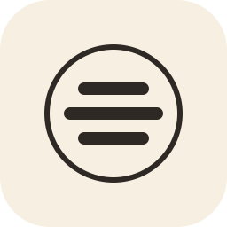

# Haiku&Hue / identity explorations

**A feeling. Three lines. A little color.**

Three original vector directions for a daily poetry-and-art studio. These are working concepts; **Three lines** is used in the repository banner as a starting point, not a final brand decision.

| 01 / Three lines | 02 / Daybreak almanac | 03 / Color in bloom |
|:---:|:---:|:---:|
|  |  |  |
| Poetry first. Quiet, compact, and direct. | A daily ritual, gathered into a collection. | Mixed feelings finding their colors. |

## 01 / Three lines - working lead

Three rounded ink strokes use a **5:7:5 width ratio**, a visual reference to the default poetic form rather than a promise that every poem has perfect syllable counts. A circular color wash gives the otherwise restrained mark a changing mood.

This is the strongest starting point for an avatar or app icon: a simple silhouette, few details, and a recognizable relationship between poetry and color. Keep the mark separate from the wordmark at small sizes.

[Color SVG](mark-three-lines.svg) | [Monochrome SVG](mark-three-lines-mono.svg)

## 02 / Daybreak almanac

An open book meets a rising sun. This direction emphasizes the growing archive and the daily return to writing. It is more literary and illustrative than the first option, making it a possible identity for **The Haiku Almanac** rather than the primary app mark.

[Daybreak SVG](mark-daybreak.svg)

## 03 / Color in bloom

Three petals gather around an ink-colored center. Rose, apricot, and sage stand for feelings that can coexist rather than a single fixed mood. This direction is softer and more expressive, with a less explicit connection to poetry.

[Bloom SVG](mark-bloom.svg)

## Palette

The core colors continue the application's existing paper-and-ink palette. Apricot adds a warm transition between rose and sage.

| Color | Hex | Role |
|---|---|---|
| Paper | `#F7EFE2` | Canvas and icon backing |
| Ink | `#2F2925` | Lettering and structural strokes |
| Muted ink | `#75675C` | Supporting text |
| Rose | `#C98578` | Reflective warmth |
| Apricot | `#DFB77B` | Light and transition |
| Sage | `#8BA888` | Calm and grounding |

Use ink for readable text; the pale accent colors are decorative fills, not text colors on paper. The opaque paper backing keeps the marks legible on both light and dark GitHub themes.

## Typography and usage

Write the project name **Haiku&Hue**, with no spaces around the ampersand. The banner pairs a Georgia/system-serif wordmark with a plain sans-serif label; it does not depend on a remote font download. The app's existing Cormorant typography can remain its own interface treatment.

All marks are self-contained SVGs with accessible titles and descriptions, a 256-by-256 viewBox, and no scripts or external resources. The icon lettering is entirely geometric; only the banner uses live text. Font metrics in the banner can vary slightly between systems.

Preserve the aspect ratio, retain at least one stroke-height of clear space around the circular mark, and use the monochrome version when a color wash is unsuitable. The supplied rounded paper tile is part of these avatar explorations. For print, remove the paper backing if needed and use the single-ink artwork.

Open [the visual gallery](index.html) in a browser locally for light/dark placement, small-size comparisons, and the full banner. GitHub displays the HTML source rather than running the gallery; the SVG previews above work directly in GitHub.

[Back to the project](../../README.md)
